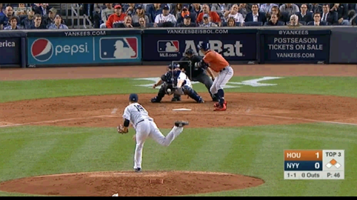
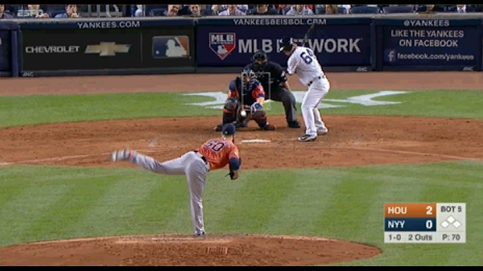

## Overview
In October 2015, the Houston Astros played the New York Yankees in the American League Wild Card game.
During and after the game, several Yankees fans took to social media to complain about inconsistencies in the strike zone being called by home plate umpire Eric Cooper.
They argued that Cooper was not calling balls and strikes consistently for both teams, putting the Yankees at a distinct disadvantage.
Beyond simple fan reaction, individual players took exception to Cooper's strike zone: after striking out, Yankees catcher Brian McCann complained to Cooper that on similar pitches, Cooper was calling strikes when the Astros were pitching but balls when the Yankees were pitching.
@fig-mccann-castro show two such pitches. 

::: {#fig-mccann-castro layout-ncol=2}

{fig-alt="Screenshot of a pitch outside the strike zone that was called a ball"#fig-mccann}


{fig-alt="Screenshot of a pitch outside the strike zone that was called a strike"#fig-castro}

:::

Both pitches were thrown low and outside[^lowoutside], near the bottom left corner of the strike zone[^strikezone] shown in the figure.
Because no part of the ball passed through the strike zone, by rule, both pitches should have been called balls.
But umpire Cooper called the pitch in @fig-mccann, thrown by Yankees pitcher Masahiro Tanaka, a ball and called the pitch in @fig-castro, thrown by Astros pitcher Dallas Keuchel, a strike.
During the television broadcast of the game and on social media after the game[^crawfish], many speculated many speculated that the reason for this discrepancy in strike zones is due Astros catcher Jason Castro's ability to *frame* pitches, catching them in a way so as to increase the chances of the umpire calling a strike.

[^lowoutside]: That is, away from the batter.

[^strikezone]: The strike zone is defined as "the area over home plate from the midpoint between a batter's shoulders and the top of the uniform pants -- when the batter is in his stance and prepared to swing at a pitched ball -- and a point just below the kneecap." See [here](https://www.mlb.com/glossary/rules/strike-zone).

[^crawfish]: See [this blogpost](https://www.crawfishboxes.com/2015/10/8/9483213/astros-pitching-dominates-yankee-hitting-with-better-pitch-framing) for a compilation of posts.

Pitch framing, which has been studied by the sabermetrics community since at least 2008, received lots of coverage in the popular press between 2014 and 2016.
A good example is [this article about Jonathan Lucroy](https://www.espn.com/mlb/story/_/id/12492794/jonathan-lucroy-needs-raise) from ESPN The Magazine, which estimated that Lucroy's framing accounted for a total of two wins for the Brewers in 2014 and was worth around $14 million.
That article went on to say that claim that the player with the most impact in baseball at that time was the game’s 17th highest-paid catcher.

In this lecture, we will estimate how many more runs a catcher saves his team through his framing compared to a replacement-level catcher using the same pitch tracking data that we used in [Lecture 6](lecture06.qmd), [Lecture 7](lecture07.qmd), and [Lecture 8](lecture08.qmd).
We will, in particular, use data from the 2024 regular season to estimate baseline strike probabilities (@sec-hgam) based on pitch location, batter handedness, and pitcher handedness.
We will then include these historical baselines as fixed effects in a multilevel model that also includes random intercepts for the catcher, pitcher, and batter involved in pitches from the 2025 season (@sec-multilevel).
Using the estimated deviations between catcher intercepts and the grand mean from our multilevel model, we conclude by estimating how many more expected runs catchers save than a replacement-level catcher (@sec-frame-war).

## Data Preparation {#sec-data-prep}

As mentioned above, we will work with two seasons of data.
First, we use data from the 2024 regular season to get a baseline strike probability based on pitch location, batter handedness, and pitcher handedness.
Since we already scraped the 2024 pitch-by-pitch data in [Lecture 6](lecture06.qmd) and saved it as an `.RData` file, we need only download the 2025 pitch data using the **sabRmetrics** package.

```{r}
#| label: download-data
#| eval: false
#| echo: true

n_cores <- parallelly::availableCores() 
if(n_cores >= 4){ #<2>
  cluster <- parallel::makeCluster(n_cores-2) 
  raw_statcast2025 <-  
    sabRmetrics::download_baseballsavant( 
      start_date = "2025-01-01", 
      end_date = "2025-12-31", 
      cl = cluster) 
  parallel::stopCluster(cluster)  
} else{
  raw_statcast2025 <- 
    sabRmetrics::download_baseballsavant(
      start_date = "2025-01-01",
      end_date = "2025-12-31")
}
save(raw_statcast2025, file = "raw_statcast2025.RData")
```

```{r}
#| label: load-statcast-data
#| eval: true
#| echo: false
load("raw_statcast2025.RData")
```
### Value of a Called Strike {#sec-called-strike-value}

Later, in @sec-frame-war, we will compute how many expected runs catchers save their teams through their pitch framing.
To do this, we must first determine the value of a called strike using a similar framework as in [Lecture 6](lecture06.qmd).
Specifically, we will compute the number of runs scored by the batting the team in the remainder of the half-inning following every pitch.
Then, for every combination of the count[^count] and the number of outs, we will compute the average number of runs scored in the remainder of the half-inning after a called ball and after a called strike on *taken pitches*[^taken].
The difference between these quantities captures the value of a called strike in that particular count-out state. 


To determine the value of a called strike during the 2025 season, we will re-use some code from [Lecture 6](lecture06.qmd#sec-runs-remaining) to compute the number of runs scored in the remainder of a half-inning following every pitch in 2025.
```{r}
#| label: compute-runs-remaining-2025
#| eval: true
#| echo: true
statcast2025 <-
  raw_statcast2025 |>
  dplyr::rename(on_1b = pre_runner_1b_id,
                on_2b = pre_runner_2b_id,
                on_3b = pre_runner_3b_id) |>
  dplyr::group_by(game_id, inning, inning_topbot) |> # <1>
  dplyr::arrange(at_bat_number, pitch_number) |> # <2>
  dplyr::mutate(RunsRemaining = dplyr::last(post_bat_score) - bat_score) |> #<3>
  dplyr::ungroup()
```
1. Divide the data based on the combination of game and half-inning
2. Arrange pitches in the appropriate temporal order
3. Add column for how many runs were scored after each pitch

We can use the `description` column of `statcast2025` to determine whether the pitch was taken or not.
```{r}
#| label: description-table
#| eval: true
#| echo: true
table(statcast2025$description)
```

The following code block builds a data table containing information just for the taken pitches. 
```{r}
#| label: build-taken
#| eval: true
#| echo: true
ball_descriptions <- 
  c("ball", "blocked_ball", "pitchout", "hit_by_pitch")
swing_descriptions <- 
  c("bunt_foul_tip", "foul", "foul_bunt", "foul_tip",
    "hit_into_play", "missed_bunt", "swinging_strike",
    "swinging_strike_block")

taken2025 <-
  statcast2025 |>
  dplyr::filter(!description %in% swing_descriptions) |> #<1>
  dplyr::mutate(
    Y = ifelse(description == "called_strike", 1, 0), #<2>
    Count = paste(balls, strikes, sep = "-")) |> #<2>
  dplyr::select(Y, plate_x, plate_z, 
                Count, outs,
                batter_id, pitcher_id, fielder_2_id, #<3>
                bat_side, pitch_hand, #<4>
                RunsRemaining, strike_zone_top, strike_zone_bottom) |> 
  dplyr::mutate(
    Count = factor(Count), #<4>
    batter = factor(batter_id), #<5>
    pitcher = factor(pitcher_id), #<5>
    catcher = factor(fielder_2_id), #<5>
    bat_side = factor(bat_side), #<6>
    pitcher_hand = factor(pitch_hand)) #<6>

```
1. Extract only the taken pitches
2. Add columns recording whether taken pitch was called a strike (`Y = 1`) or a ball (`Y = 0`) and the count.
3. `fielder_2_id` contains the MLB Advanced Media ID for the catcher
4. `bat_side` and `pitcher_hand` record the handedness of the batter and pitcher.
5. We will eventually fit a multi-level model that includes random effects for the batter, pitcher, and catcher. So, it is useful to convert their identifiers into a factor.
6. Since `bat_side` and `pitcher_hand` are categorical variables, each taking values `L` (for left-handed players) and `R` (for right-handed players), it is useful to convert them to factors. 


We can now compute the expected numbers of runs scored after a called ball or strike for every combination of out and count.
```{r}
#| label: er-taken
#| eval: true
#| echo: true

er_balls <-
  taken2025 |>
  dplyr::filter(Y == 0) |>
  dplyr::group_by(Count, outs) |>
  dplyr::summarise(er_ball = mean(RunsRemaining), .groups = 'drop')

er_strikes <-
  taken2025 |>
  dplyr::filter(Y == 1) |>
  dplyr::group_by(Count, outs) |>
  dplyr::summarise(er_strike = mean(RunsRemaining), .groups = 'drop')

er_taken <-
  er_balls |>
  dplyr::left_join(y = er_strikes, by = c("Count", "outs")) |>
  dplyr::mutate(value = er_ball - er_strike)

er_taken |> dplyr::slice_head(n=5)
```

[^taken]: These are pitches in which the batter doesn't swing.


[^count]: The numbers of balls and strikes previously called in the at-bat. 


```{r}
#| label: er-taken-examples
#| eval: true
#| echo: false

ex1_ball <- er_taken |> dplyr::filter(Count == "0-0" & outs == 0) |> dplyr::pull(er_ball)
ex1_strike <- er_taken |> dplyr::filter(Count == "0-0" & outs == 0) |> dplyr::pull(er_strike)
ex1_value <- er_taken |> dplyr::filter(Count == "0-0" & outs == 0) |> dplyr::pull(value)

ex2_value <- er_taken |> dplyr::slice_max(value) |> dplyr::pull(value)
ex3_value <- er_taken |> dplyr::slice_min(value) |> dplyr::pull(value)
```
Looking at `er_taken`, we find that batting teams score

  * About `{r} round(ex1_ball, digits = 3)` runs following a called ball on a 0-0 pitch with 0 outs
  * About `{r} round(ex1_strike, digits = 3)` runs following a called strike on a 0-0 pitch with 0 outs
  
So, if a good pitch framer can get a 0-0 pitch with 0 outs called a strike instead of ball, he saves the fielding team about `{r} round(ex1_value, digits = 3) `runs, on average. 
From the standpoint of the fielding team, a called strike is most valuable on a 3-2 pitch with 0 outs (when they can expect to save almost `{r} round(ex2_value, digits = 3)` runs on average) and least valuable on a 0-0 pitch with 2 outs (when they can expect to save about `{r} round(ex3_value, digits = 3)` runs on average).
```{r}
#| label: er-taken-sorted
#| eval: true
#| echo: true
er_taken |> dplyr::arrange(dplyr::desc(value)) |> dplyr::slice(c(1, dplyr::n()))
```
So that we can use it later in @sec-frame-war, we will append a column to `taken2024` containing the value of a called strike (from the fielding team's perspective).
```{r}
#| label: append-er-taken
#| eval: true
#| echo: true
taken2025 <-
  taken2025 |>
  dplyr::left_join(y = er_taken |> dplyr::select(Count, outs, value), by = c("Count", "outs"))
```


## A Multilevel Model{#sec-multilevel}

We are ultimately interested in understanding how individual players (i.e., batters, catchers, and pitchers) can influence the called strike probability.
Any credible model for these probabilities must account for location.
After all, if a pitch is thrown several feet away from the batter, no amount of pitch framing will change the call from a ball to a strike.
Similarly, catcher skill is likely n
The StatCast variables `plate_x` and `plate_z` respectively record the horizontal and vertical coordinate of each pitch as it crosses the front edge of home plate.
These variables are measured from the catcher's perspective so pitches thrown to the left of home plate have negative `plate_x` values and pitches thrown to the right of home plate have positive `plate_x` values.
Both `plate_x` and `plate_z` are measured in feet.

A natural starting point is to fit a multilevel model with player-specific random intercepts that adjusts for the fixed effects of `plate_x` and `plate_z`.
Specifically, because we are dealing with a binary outcome, we might start with the model
$$
\log \left( \frac{\mathbb{P}(Y_{i} = 1)}{\mathbb{P}(Y_{i} = 0)} \right) = B_{b[i]} + C_{c[i]} + P_{p[i]} + \beta_{x} x_{i} + \beta_{z}z_{i}
$$
where $b[i], c[i],$ and $p[i]$ record the identities of the batter, catcher, and pitcher involved in taken pitch $i;$ $x_{i}$ and $z_{i}$ are the `plate_x` and `plate_z` measurements; and the $B_{b}$'s, $C_{c}$'s, and $P_{p}$'s are random intercepts for the batters, catchers, and pitchers with $B_{b} \sim N(\mu_{B}, \sigma^{2}_{B}),$ $C_{c} \sim N(\mu_{C}, \sigma^{2}_{C})$, and $P_{p} \sim N(\mu_{P})$.
This simple model **assumes** that the log-odds of a called strike is monotonic in `plate_x` and `plate_z`.
Due to the monotonicity of the inverse logistic transformation[^invlogit], a positive (resp. negative) $\beta_{x}$ would imply that the probability of a called strike increases (resp. decreases) as the pitch moves from left to right.
Similarly, a positive (resp. negative) $\beta_{z}$ implies that the probability of a called strike increases (resp. decreases) the higher up a pitch is thrown.

[^invlogit]: If $u = \log{\frac{p}{1-p}}$ for some $p \in [0,1],$ then $p = 1/[1 + e^{-u}]$, which is monotonically increasing as  

A cursory glance at the data reveals such monotonicity is not realistic. 
Specifically, if called strike probability was monotonic in `plate_x` and `plate_z`, then we should see progressively more strikes in one of the four corners of the plot[^prove].
In the plot, we overlay the "average" rule book strike zone[^avg_rbsz]. 
```{r}
#| label: fig-calls-25
#| fig-align: center
#| fig-width: 5
#| fig-height: 6
#| fig-cap: All called balls and strikes
#| fig-alt: Scatterplot of the location of all balls (blue) and strikes (red)
par(mar = c(3,3,2,1), mgp = c(1.8, 0.5, 0))
plot(1, type = "n",
     xlim = c(-2.5, 2.5), ylim = c(0, 6), #<1>
     xlab = "", ylab = "",
     main = "Called pitches (2025)",
     xaxt = "n", yaxt = "n", bty = "n")
points(x = taken2025$plate_x, y = taken2025$plate_z,
       pch = 16, cex = 0.25,
       col = ifelse(taken2025$Y == 1, rgb(1, 0, 0, 0.25), rgb(0,0,1,0.25))) #<2>
rect(xleft = -8.5/12, 
     ybottom = mean(taken2025$strike_zone_bottom, na.rm = TRUE),
     xright = 8.5/12,
     ytop = mean(taken2025$strike_zone_top, na.rm = TRUE))
```
1. Restrict attention to pitches that are not in the dirt (i.e., `plate_z > 0`) but not thrown too high (i.e. `plate_z < 6`), are within 2.5 feet of the center of home plate in either direction.
2. Color strikes (`Y = 1`) in red and balls in blue (`Y = 0`). The 0.25 sets the transparency

[^avg_rbsz]: Home plate measures 17 inches across, so we set the horizontal limits at -8.5/12 and 8.5/12. To set the vertical limits, we take the average values of the StatCast variable `strike_zone_top` and `strike_zone_bot`, which are *manually* determined by the StatCast operator on every pitch

[^prove]: Try to prove yourself by considering four cases, one for each combination of the sign of $\beta_{x}$ and $\beta_{z}$ in the model above.

Letting $n_{B}, n_{C},$ and $n_{P}$ be the numbers of batters, catchers, and pitchers, we will instead model
$$
\log \left( \frac{\mathbb{P}(Y_{i} = 1)}{\mathbb{P}(Y_{i} = 0)} \right) = B_{b[i]} + C_{c[i]} + P_{p[i]} + \beta_{p} \log\left(\frac{\hat{p}(x_{i}, z_{i})}{1 - \hat{p}(x_{i}, z_{i})}\right)
$$
where $\hat{p}(x,z)$ is a *baseline* called strike probability estimated using data from the previous season[^jqas] and the random player intercepts satisfy
$$
\begin{align}
B_{b} &= \mu_{B} + u_{b}^{(B)}; \quad u^{(B)}_{b} \sim N(0, \sigma^{2}_{B}) \quad \text{for each}~b = 1, \ldots, n_{B} \\
C_{c} &= \mu_{C} + u_{c}^{(C)}; \quad u^{(C)}_{c} \sim N(0, \sigma^{2}_{C}) \quad \text{for each}~c = 1, \ldots, n_{C} \\
P_{p} &= \mu_{P} + u_{p}^{(P)}; \quad u^{(P)}_{p} \sim N(0, \sigma^{2}_{P}) \quad \text{for each}~p = 1, \ldots, n_{P}. \\
\end{align}
$$
Our model accounts for pitch location by including a suitably-transformed baseline called strike probability estimate as a fixed effect.
The random player intercepts capture how much each player contributions to the log-odds of a called strike *over and above what is determined by pitch location*.

[^jqas]: The strategy to include a suitably-transformed baseline probability estimates was first used by Judge, Pavlidis, and Brooks in a [2015 Baseball Prospectus article](https://www.baseballprospectus.com/article.php?articleid=25514). It was also used by @DeshpandeWyner2017 (see Section 2.2 of that paper).

### Historical Strike Probabilities {#sec-hgam}

To fit our proposed multilevel model, we must first compute the baseline called strike probabilities using data from the 2024 season.
Luckily, we scraped that data already in [Lecture 6](lecture06.qmd#sec-statcast-query) and had saved it as a `.RData` file.
So, we can simply load in that file instead of re-scraping everything
```{r}
#| label: load-statcast2024
#| eval: true
#| echo: true
load("statcast2024.RData")
```


Using a similar process as above, we can extract all called pitches from `statcast2024`.
Unlike the above, however, we will fit our generalized additive model only to pitches with `plate_x` values between -1.5 and 1.5 and `plate_z` values between 1 and 6.
Beyond this region there are virtually no called strikes.
Including pitches that are too far away from the strike zone --- i.e., pitches for which the called strike probability is likely *exactly* zero --- can lead to some numerical instabilities when fitting the GAM.


```{r}
#| label: build-taken2024
#| eval: true
#| echo: true

taken2024 <-
  statcast2024 |>
  dplyr::filter(!description %in% swing_descriptions) |> 
  dplyr::mutate(
    Y = ifelse(description == "called_strike", 1, 0)) |> 
  dplyr::select(Y, plate_x, plate_z, bat_side, pitch_hand) |> 
  dplyr::filter(!is.na(plate_x) & !is.na(plate_z)) |>
  dplyr::filter(abs(plate_x) <= 1.5 & plate_z >= 1 & plate_z <= 6) |>
  dplyr::mutate(
    bat_side = factor(bat_side),
    pitch_hand = factor(pitch_hand))
```

We now fit our generalized additive model.

:::{.callout-important}
## Warning
The following code takes several minutes to run.
:::


```{r}
#| label: fit-hgam
#| message: false
library(mgcv)
hgam_fit <- #<1>
  bam(formula = Y ~ bat_side + pitch_hand + s(plate_x, plate_z),  
      family = binomial(link="logit"), 
      data = taken2024)
```
1. The "h" serves as a reminder that we're getting **h**istorical called strike probabilities

Like we did with our model for the probability of making an out as a function of fielding location in [Lecture 8](lecture08.qmd#sec-out-gam), we can visualize the fitted probabilities along a fine grid of locations.
The following code plots the fitted called strike probabilities as a function of location for a right-handed pitcher facing a right-handed batter.
```{r}
#| label: fig-hgam-RR
#| fig-width: 5
#| fig-height: 6
#| fig-align: "center"
#| fig-cap: Historical called strike probabilities for a right-handed batter facing a right-handed pitcher.
#| fig-alt: Heatmap showing the baseline called strike probaiblities estimated using data from the 2024 season

grid_sep <- 0.05
x_grid <- seq(-1.5, 1.5, by = grid_sep)
z_grid <- seq(0, 6, by = grid_sep)
col_list <- colorBlindness::Blue2DarkRed18Steps 
plate_grid <- 
  expand.grid(plate_x = x_grid, plate_z = z_grid) |>
  dplyr::mutate(bat_side = "R", pitch_hand = "R") |> #<1>
  dplyr::mutate(bat_side = factor(bat_side, levels = c("L", "R")), #<2>
                pitch_hand = factor(pitch_hand, levels = c("L", "R"))) #<2>

grid_preds <-
  predict(object = hgam_fit,
          newdata = plate_grid,
          type = "response")
grid_prob_cols <- 
  rgb(colorRamp(col_list,bias=1)(grid_preds)/255)
par(mar = c(3,3,2,1), mgp = c(1.8, 0.5, 0))
plot(1, type = "n", 
     xlim = c(-1.5, 1.5), ylim = c(0,6),
     main = "Historical called strike probabilities",
     xlab = "", ylab = "", 
     xaxt = "n", yaxt = "n")
for(i in 1:nrow(plate_grid)){
  rect(xleft = plate_grid$plate_x[i] - grid_sep/2, 
       ybot = plate_grid$plate_z[i] - grid_sep/2,
       xright = plate_grid$plate_x[i] + grid_sep/2,
       ytop = plate_grid$plate_z[i] + grid_sep/2,
       col = adjustcolor(grid_prob_cols[i], alpha.f = 0.5), #<3>
       border = NA)
}
rect(xleft = -8.5/12, 
     ybottom = mean(taken2025$strike_zone_bottom, na.rm = TRUE),
     xright = 8.5/12,
     ytop = mean(taken2025$strike_zone_top, na.rm = TRUE))

```
1. Change this line to visualize the fitted probabilities for different combinations of batter and pitcher handedness
2. We will eventually pass `plate_grid` to the `predict` function, which will expect both `stand` and `p_throws` to be factor variables


### Fitting Our Multilevel Model {#sec-fit-multilevel}

Now that we have fit a GAM model to the historical data, we are ready to compute the baseline log-odds for a called strike for each pitch from 2025.
We can do this using the `predict` function with the argument `type = "link"` instead of `type  = "response"`.
```{r}
#| label: append-hgam-2025
#| eval: true
#| echo: true

baseline <- 
  predict(object = hgam_fit,
          newdata = taken2025, 
          type = "link")
taken2025 <-
  taken2025 |>
  dplyr::mutate(baseline = baseline) |>
  dplyr::filter(abs(plate_x) <= 1.5 & plate_z >= 1 & plate_z <= 6) #<1>

```
1. We focus only on "frameable" pitches which are not throw too far away from home plate in the horizontal direction and are not thrown too high or too low in the vertical direction.

We're finally ready to fit our multilevel model
```{r}
#| label: fit-multilevel
#| message: false
library(lme4)
multilevel_fit <-
  glmer(formula = Y ~ 1 + (1 | catcher) + (1 | batter)  + (1 | pitcher) +  baseline, #<1>
        family = binomial(link = "logit"), #<1>
        data = taken2025)
```
1. Because the outcome is binary, we need to use the function `glmer()` instead of `lmer()`. We moreover need to specify the `family` argument.

Although we cannot estimate the actual player-specific random intercepts $B_{b}, C_{c}$ and $P_{p},$ we can estimate the deviations between these the overall global means $\mu_{B}, \mu_{C},$ and $\mu_{P}.$
The following code pulls out the deviations for the catchers (i.e., the deviations $u_{c}^{(C)}$) and appends these values to 
```{r}
#| label: catcher-ranef
tmp <- ranef(multilevel_fit)
catcher_u <- 
  data.frame(
    fielder_2_id = as.integer(rownames(tmp[["catcher"]])), #<1>
    catcher_u = tmp[["catcher"]][,1])
```
1. The MLB Advanced Media IDs are saved as integers but `rownames()` returns them as a string.


## Runs Saved Above Replacement {#sec-frame-war}

The data table `catcher_u` estimates of the amount each catcher adds to log-odds of a called strike, after adjusting for the historical baseline and the other players, relative to a global average across a super-population of catchers.
As we argued in [Lecture 10](lecture10.qmd), it is arguably more useful to compare each individual catcher's performance to a well-defined replacement level rather than to a nebulously defined global average.
Noting that most MLB teams carry two catchers on their active roster, we will sort catchers based on the total number of pitches received in the 2024 season.
We define the top-60 as non-replacement level and the remaining catchers as replacement-level.

The following code determines the pitch count threshold for defining replacement-level.
It then computes the average of the estimated deviations $u^{(C)}_{c}$'s across all replacement-level catchers.
We will denote this average by $\overline{u}^{(C)}_{R}.$
```{r}
#| label: define-replacement-catcher
#| eval: true
#| echo: true
catcher_counts <-
  statcast2025 |>
  dplyr::group_by(fielder_2_id) |>
  dplyr::summarise(count = dplyr::n()) |>
  dplyr::arrange(dplyr::desc(count)) 

catcher_threshold <- 
  catcher_counts |>
  dplyr::slice(60) |>
  dplyr::pull(count)

catcher_u <-
  catcher_u |>
  dplyr::left_join(y = catcher_counts, by = "fielder_2_id")

repl_u <-
  catcher_u |>
  dplyr::filter(count < catcher_threshold) |>
  dplyr::pull(catcher_u) |>
  mean()
```

For every pitch thrown in 2025, we can estimate how the called strike probability changes when the original catcher is replaced with a replacement-level catcher.
First, observe that the log-odds of a called strike on pitch $i$ is given by 
$$
\mu_{C} + u_{c[i]}^{(C)} + B_{b[i]} + P_{p[i]} + \hat{\beta}_{p} \times \log\left(\frac{\hat{p}(x_{i}, z_{i})}{1 - \hat{p}(x_{i}, z_{i})} \right)
$$
We can compute these predicted log-odds using the `predict()` function and append them to the data table `taken2024`:
```{r}
#| label: get-ml-prediction
#| eval: true
#| echo: true

ml_preds <-
  predict(object = multilevel_fit,
          newdata = taken2025,
          type = "link") #<1>
taken2025 <- 
  taken2025 |>
  dplyr::mutate(fitted_log_odds = ml_preds)
```
1. Since we want the fitted log-odds and not the fitted probabilities, we specify `type = "link"`.

If we replace the original catcher $c[i]$ with a replacement-level catcher, then the log-odds of a called strike is now
$$
\mu_{C} + \overline{u}_{R}^{(C)} + B_{b[i]} + P_{p[i]} + \hat{\beta}_{p} \times \log\left(\frac{\hat{p}(x_{i}, z_{i})}{1 - \hat{p}(x_{i}, z_{i})} \right)
$$
To compute the counter-factual log-odds, we need to take the fitted log-odds, subtract the original catcher's deviation $u_{c[i]}^{(C)}$, and add the average deviation across all replacement-level catchers (i.e., $\overline{u}_{R}^{(C)}$).
The following code does this by first appending the estimated $u^{(C)}_{c[i]}$ to each row of `taken2024` and then computing the counter-factual log-odds
```{r}
#| label: compute-repl-log-odds
#| eval: true
#| echo: true

taken2025 <-
  taken2025 |>
  dplyr::left_join(y = catcher_u |> 
                     dplyr::select(fielder_2_id, catcher_u),
                   by = "fielder_2_id") |>
  dplyr::mutate(repl_log_odds = fitted_log_odds - catcher_u + repl_u) 
```


The number of expected runs a catcher saves through his framing relative to a replacement-level catcher is the product of the value of a called strike multiplied by the actual and counter-factual called strike probability.
```{r}
#| label: compute-rsar
taken2025 <-
  taken2025 |>
  dplyr::mutate(
    fitted_prob = 1/(1 + exp(-1 * fitted_log_odds)),
    repl_prob = 1/(1 + exp(-1 * repl_log_odds)),
    rsar = value * (fitted_prob - repl_prob))
```

Summing over all pitches received by a catcher over the season, we can compute his total number of runs saved above replacement.
In the following code, we create a player-lookup table like we did in [Lecture 6](lecture06.qmd). 
```{r}
#| label: player-lookup-2025
#| eval: true
#| echo: true
load("chadwick_players.RData")
player2025_id <- # <2>
  unique(
    c(statcast2025$batter_id, statcast2025$pitcher_id,
      statcast2025$on_1b, statcast2025$on_2b, statcast2025$on_3b,
      statcast2025$fielder_2_id, statcast2025$fielder_3_id,
      statcast2025$fielder_4_id, statcast2025$fielder_5_id, 
      statcast2025$fielder_6_id, statcast2025$fielder_7_id, 
      statcast2025$fielder_8_id, statcast2025$fielder_9_id))


player2025_lookup <-
  chadwick_players |>
  dplyr::filter(!is.na(key_mlbam) & key_mlbam %in% player2025_id) |>
  dplyr::mutate(
    FullName = paste(name_first, name_last), # <3>
    Name = stringi::stri_trans_general(FullName, "Latin-ASCII")) # <4>
save(player2025_lookup, file = "mlb_player2025_lookup.RData")
```

We can now sort catchers by their runs saved above replacement. 
```{r}
#| label: tabulate-rsar
#| eval: true
#| echo: true


rsar <-
  taken2025 |>
  dplyr::group_by(fielder_2_id) |>
  dplyr::summarise(rsar = sum(rsar), n = dplyr::n()) |> 
  dplyr::rename(key_mlbam = fielder_2_id) |>
  dplyr::left_join(player2025_lookup |>
                     dplyr::select(key_mlbam, Name), by = "key_mlbam")
```
There is considerable overlap between the top-10 catchers according to our framing runs saved above replacement metric and the top-10 catchers according to rankings produced by [Baseball Savant](https://baseballsavant.mlb.com/leaderboard/catcher-framing?count=&gameType=Regular&seasonStart=2024&seasonEnd=2024&type=catcher&minPitches=q&minResults=1&sortColumn=rv_tot&sortDirection=desc).
Both models, for instance, identify Patrick Bailey, who won a Golden Glove award in 2024 and 2025, as a particularly strong framer.
```{r}
#| label: top-10-rsar
rsar |>
  dplyr::arrange(dplyr::desc(rsar)) |>
  dplyr::slice_head(n = 10) |>
  dplyr::select(Name, rsar, n)
```

