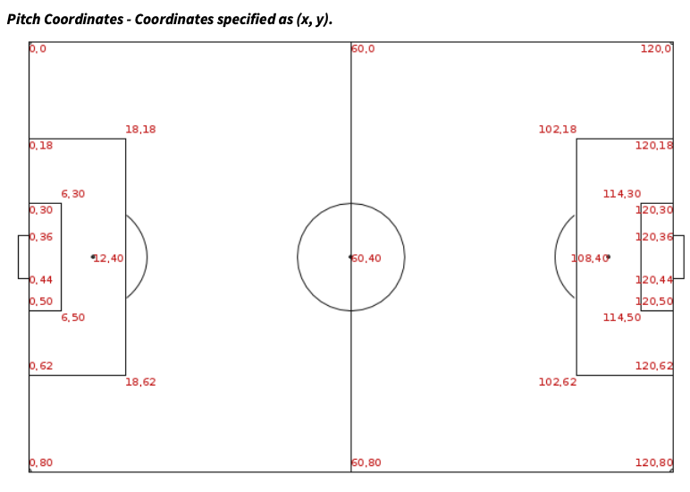

# Motivation & Outline

## Motivation: Beth Mead in EURO 2022{.smaller}
- Beth Mead scored 6 goals in EURO 2022. Which was more impressive?
  - Goal in 15th minute against Austria [link](https://youtube.com/clip/UgkxnOKsnw4W3h-BqV5kyh-tOVnnTgBEc9u5?si=zpQB7OF43gt3yiwK)
  - Goal in 37th minute against Norway [link](https://youtube.com/clip/UgkxqZ03bRBGCr4vS0M4yTMtHMOHsA6kkTHw?si=2IlC7AVi2CQotunG)
  - Goal in 33rd minute against Sweden [link](https://youtube.com/clip/UgkxwW9N1bXUv4G9HoSHVvYy_rk_aSjkrgwO?si=O90nkbgNd2FTv3e_)

. . .

- We can argue endlessly about *qualitative* differences
  - One-on-one vs in-traffic; left or right foot; 
  - Type of shot; time; score; ...
  
. . .

- Goal: **quantitative** comparison

## A Thought Experiment

- What if we could replay each shot over and over again?
- How often would she score?

{width="60%" fig-align="center"}

- This long-run frequency is Expected Goals (XG) 

## StatsBomb & Hudl
- Player location data for all events
  * Computer vision + input from 5 human annotators
  * Humans log events (shots, tackles, passes, etc.)
  * Computer vision to extra location information
- Locations mapped to fixed coordinate system
- **StatsBombR** package: available via GitHub
```{r}
#| label: install-statsbomb
#| eval: false
#| echo: true
devtools::install_github("statsbomb/StatsBombR")
```

## StatsBomb Coordinates

- Offensive action moves left-to-right
- Vertical coordinate increases as you move top-to-bottom

{fig-asp=0.75, width="60%"}


## Thought Experiment: Repeating Shots

- What proportion of repetitions result in goals?
- Across all repetitions, conditions kept the same

{width="60%" fig-align="center"}


## Setup & Notation
- Suppose our data set contains $n$ shots
- For shot $i = 1, \ldots, n,$ we observe
  - $Y_{i}$: indicator shot resulted in goal ($Y = 1$) or not ($Y = 0$)
  - $\boldsymbol{\mathbf{X}}_{i}$: vector of $p$ features about the shot
- Features could include things like
  - Body part used & shot technique
  - Dist. to nearest defenders


## Conditional Probability
- Assumption: data are a representative sample from an infinite *super-population* of shots
- Each shot in super-population characterized by pair $(\boldsymbol{\mathbf{X}}, Y)$
- Repeating shot with features $\boldsymbol{\mathbf{x}}$ equivalent to sampling from *slice* of super-population with $\boldsymbol{\mathbf{X}} = \boldsymbol{\mathbf{x}}.$

. . .

$$
\textrm{XG}(\boldsymbol{\mathbf{x}}) = \mathbb{E}[Y \vert \boldsymbol{\mathbf{X}} = \boldsymbol{\mathbf{x}}] = \mathbb{P}(Y = 1 \vert \boldsymbol{\mathbf{X}} = \boldsymbol{\mathbf{x}})
$$

# Two Basic XG Models

## Defining The Super-population

- Ultimate goal is to assess Mead's performance in EURO 2022
  - Focus on women's internationals
  - Focus on shots attempted w/ foot or head

- If we could access infinite super-population, compute $\textrm{XG}(\text{right-footed shot})$ by
  - Forming subgroup containing only right-footed shots
  - Calculating proportion of goals score

## Practical Calculation
- Since we cannot access infinite super-population, we must **estimate** XG from data
- We can do so by mimicking idealized calculation
  1. Divide data into subgroups based on `shot.body_part.name`
  2. Compute proportion of goals within subgroups
- Rely on **dplyr**'s `group_by()` functionality to do this

# Towards More Sophisticated XG Models

## Accounting For Shot Technique
- Each goal was scored off a different type of shot
- What if we condition body part & shot technique?

. . .

- Can similarly "bin and average" with a grouped summary

## Including More Features
- Our 2-feature model is still too coarse
  - Doesn't account for distance of shot
  - Doesn't account for defenders and keeper
- StatsBomb records many more features about shots
- How can we adjust for these in our XG model?

## Idealized Computation

- If we could access super-population, easy to condition on more features
  - Slice population along $\mathbf{\boldsymbol{x}}$
  - Compute proportion of goals among the slice with $\mathbf{\boldsymbol{X}} = \mathbf{\boldsymbol{x}}$
- Can we mimic this with our observed data?


## Modeling XG{.smaller}
- "Binning-and-averaging" not viable w/ many features due to small sample sizes
- *Statistical models* overcome these challenges by "borrowing strength"
- $\textrm{XG}(\boldsymbol{\mathbf{x}})$ informed by shots with $\boldsymbol{\mathbf{X}} = \boldsymbol{\mathbf{x}}$ and $\boldsymbol{\mathbf{X}} \approx \boldsymbol{\mathbf{x}}$
- How a model "borrows strength" depends on its underlying assumptions

. . .  

- Several challenges: 
  - $\mathbf{\boldsymbol{X}}$ may be high-dimensional
  - $\textrm{XG}$ likely depends on many interactions
  - $\textrm{XG}$ likely highly non-linear
- StatsBomb has a proprietary model (`shots.statsbomb_xg`)


# Goals Over Expected

## Did Mead Outperform Expectations?
- How to interpret the difference $Y_{i} - \textrm{XG}_{i}$ when it is
  - Large & positive
  - Large & negative
  - Close to 0


## Looking Ahead
- I **strongly** recommend you work through code yourself
  - Full code available [here](../../lectures/lecture02.qmd)
  - Try more binning-and-averaging XG estimates w/ other features
  - Try to replicate goals over expected with EURO 2025 data

- Will post code for plotting all players during a shot
  - `shot.freeze_frame` contains data frame with other players & their positions

## Project Groups

- Form groups by **Friday September 11** 
- Use Piazza to find group members
- Signup for teams [here](https://docs.google.com/spreadsheets/d/1aGQ9m2OKLRnTq11pLawBTwF8oxFPIaRmYWvD_8kGhoo/edit?gid=0#gid=0)

