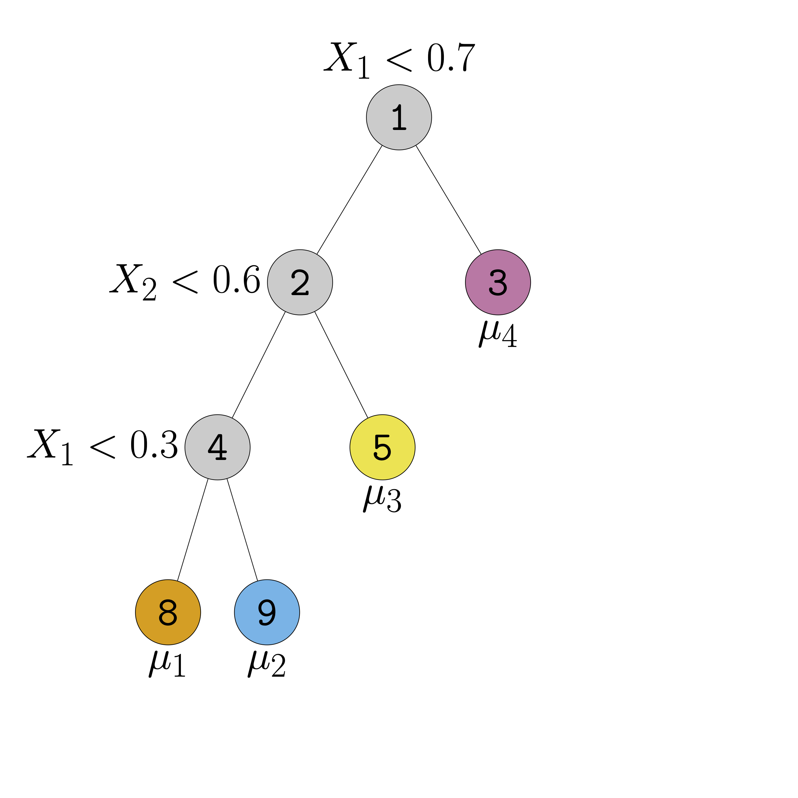
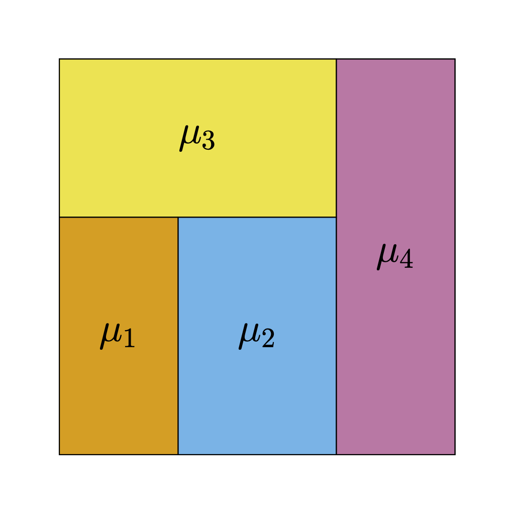
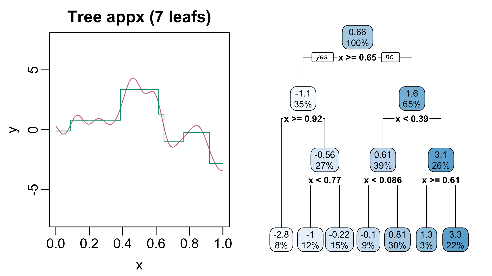
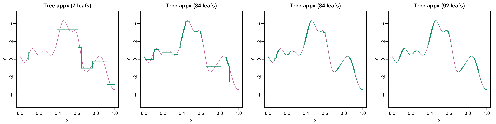
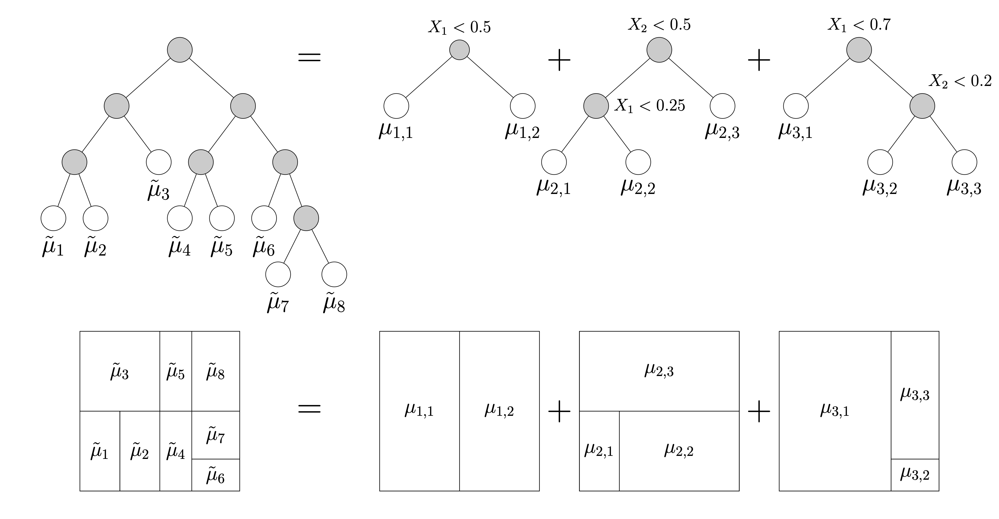

## Recap

- In [Lecture 2](../../lectures/lecture02.qmd), fit two XG models
  - Model 1 accounted for body part
  - Model 2 accounted for body part + technique
- Which model is better?
  - Which fits the observed data best?
  - Which will predict new data best? 

## Qualitative Comparisons

- Consider two shots:
  - [Right-footed half-volley](https://youtu.be/lVGiGZN2gdw?t=148) by Beth Mead against Sweden
  - [Right-footed backheel](https://youtu.be/rsuLFOJCCUA?t=7) by Alessia Russo

. . .

- Model 2 accounts for more factors
- Intuitively expect it is more accurate

## Setup & Notation
- Data: $n$ shots represented by pairs $(\boldsymbol{\mathbf{x}}_{1}, y_{1}), \ldots, (\boldsymbol{\mathbf{x}}_{n}, y_{n})$
  - Outcomes: $y_{i} = 1$ if shot $i$ results in a goal & 0 otherwise
  - Feature vector: $\boldsymbol{\mathbf{x}}_{i}$
- Assumption: Data is a representative sample from an infinite super-population of shots
$$
\textrm{XG}(\boldsymbol{\mathbf{x}}) = \mathbb{E}[Y \vert \boldsymbol{\mathbf{X}} = \boldsymbol{\mathbf{x}}]
$$

. . .

- $\hat{p}_{i}$: predicted $\textrm{XG}$ for shot $i$ from fitted model
- How close is $\hat{p}_{i}$ to $y_{i}$?

## Misclassification Rate (Definition) {.smaller}

- $\hat{p}_{i} > 0.5:$ model predicts $y_{i} = 1$ more likely than $y_{i} = 0$
- Ideal: $\hat{p}_{i} > 0.5$ when $y_{i} = 1$ and $\hat{p}_{i} < 0.5$ when $y_{i} = 0$
- If too many $\hat{p}_{i}$'s on wrong-side of 50%, model is badly calibrated.

. . .

$$
\textrm{MISS} = n^{-1}\sum_{i = 1}^{n}{\mathbb{I}(y_{i} \neq \mathbb{I}(\hat{p}_{i} \geq 0.5))},
$$


## Brier Score (Definition) {.smaller}
- MISS only cares whether $\hat{p}_{i}$ is on the wrong-side of 50%
  - Forecasting $\hat{p} = 0.501$ and $\hat{p} = 0.999$ have same loss when $y = 0$
  - Doesn't penalize how **far** $\hat{p}$ is from $Y$

. . .

- Brier Score penalizes distance b/w forecast $\hat{p}$ & $Y$
$$
\text{Brier} = n^{-1}\sum_{i = 1}^{n}{(y_{i} - \hat{p}_{i})^2}.
$$
- Just Mean Square Error applied to binary outcomes


## Log-Loss (Definition)
- Like Brier but penalizes extreme mistakes more severely

$$
\textrm{LogLoss} = -1 \times \sum_{i = 1}^{n}{\left[ y_{i} \times \log(\hat{p}_{i}) + (1 - y_{i})\times\log(1-\hat{p}_{i})\right]}.
$$

. . .

- Theoretically, can be infinite (when $\hat{p} = 1-y$)
- In practice, truncate $\hat{p}$ to $[\epsilon,1-\epsilon]$ to avoid $\log(0)$
- Also known as cross-entropy loss in ML literature


# Estimating Out-of-Sample Error

## In-sample Error
- Recall our setup:
  - Data is a sample from super-population $\mathcal{P}$
  - Fit model to *estimate* $\mathbb{E}[Y \vert \boldsymbol{\mathbf{X}} = \boldsymbol{\mathbf{x}}]$
  - Fitted model returns predictions $\hat{p}(\boldsymbol{\mathbf{x}})$
- Computed $\textrm{MISS}, \textrm{Brier},$ and $\textrm{LogLoss}$ w/ same data used to fit model
- This only checks whether model fits **observed** data well

. . . 

- How well does model predict *new*, previously unseen data?

  
## Out-of-Sample Error

- Say we had a second dataset $(\boldsymbol{\mathbf{x}}_{1}^{\star}, y_{1}^{\star}), \ldots, (\boldsymbol{\mathbf{x}}_{m}^{\star}, y_{M}^{\star})$ from $\mathcal{P}$
- Compute predictions $\hat{p}^{\star}_{m}:= \hat{p}(\boldsymbol{\mathbf{x}}_{m}^{\star})$
  - Important: $(\boldsymbol{\mathbf{x}}_{m}^{\star}, y_{m}^{\star})$'s not used to fit the model
  
. . .

- Assess how close $\hat{p}^{\star}_{m}$'s are to $y^{\star}_{m}$'s
  - Could use misclassification rate, Brier score, or log-loss
  - Result is the out-of-sample loss


## Cross-Validation

- Problem: we don't have access to a second dataset

. . .

- Solution: create *random* training/testing split
  - Train on a random subset containing 75% of the data
  - Evaluate using the remaining held-out portion


## Multiple Splits{.smaller}

- Recommend averaging over many train/test splits (e.g., 100)
- See [lecture notes](../../lectures/lecture03.qmd) for full code
- Each iteration in a `for()` loop:
  - Sets new seed & form new train/test split
  - Re-trains both XG models and computes train & test error
  - Save errors in an array

# Logistic Regression
  
## Motivation: Accounting for Distance
  
- Model 1 gives same prediction for
  - A header from 1m away
  - A header from 15m away
- How to account for continuous feature like `DistToGoal`?
  
. . .

- Idea: Divide into discrete bins and then average within bins
  - Problem: sensitivity to bin sizes (1m , 3m, 10m)
  - Problem: potential small sample issues
  
## Logistic Regression{.smaller}

- Binary outcome $Y$ and numerical predictors $X_{1}, \ldots, X_{p}$:
$$
\log\left(\frac{\mathbb{P}(Y= 1 \vert \boldsymbol{\mathbf{X}})}{\mathbb{P}(Y = 0 \vert \boldsymbol{\mathbf{X}})}\right) = \beta_{0} + \beta_{1}X_{1} + \cdots + \beta_{p}X_{p}.
$$
  
- Keeping all other predictors constant, a one unit change in $X_{j}$ associated with a $\beta_{j}$ change in the log-odds
- Say $\beta_{j} = 1$. Increasing $X_{j}$ by 1 unit moves $\mathbb{P}(Y = 1)$
  - From 4.7% to 11.2% (log-odds from -3 to -2)
  - From 37.8% to 62.2% (log-odds from -0.5 to 0.5)
  - From 73.1% to 88.1% (log-odds from 1 to 2)

## Logistic & Inverse Logistic Functions

- Logistic function: $f(t) = [1 + e^{-t}]^{-1}$
- Inverse logistic: $f^{-1}(p) = \log{p/(1-p)}$
```{r}
#| label: fig-logistic
#| fig-width: 6
#| fig-asp: 0.5625
#| fig-align: center
#| fig-cap: Logistic and inverse logistic functions

par(mar = c(3,3,2,1), mgp = c(1.8, 0.5, 0), mfrow = c(1,2))
p_seq <- seq(0.01, 0.99, by = 0.01)
t_seq <- log(p_seq/(1-p_seq))

plot(1, type = "n", 
     xlim = c(-5,5), ylim = c(0,1), 
     xlab = "t", ylab = "p", main = "Logistic")
lines(t_seq, p_seq)

x <- c(-3, -2, -0.5, 0.5, 1, 2)
y <- 1/(1 + exp(-1 * x))
points(x = x, y = y, pch = 16)

lines(x = c(-3,-2), y = 1/(1 + exp(-1*c(-3,-3))), lty = 2)
lines(x = c(-0.5, 0.5), y = 1/(1 + exp(-1*c(-0.5, -0.5))), lty = 2)
lines(x = c(1,2), y = 1/(1 + exp(-1*c(1,1))), lty = 2)

lines(x = c(-2,-2), y = 1/(1 + exp(-1*c(-3,-2))), lty = 2)
lines(x = c(0.5, 0.5), y = 1/(1 + exp(-1*c(-0.5, 0.5))), lty = 2)
lines(x = c(2,2), y = 1/(1 + exp(-1*c(1,2))), lty = 2)

plot(1, type = "n",
     xlim = c(0,1), ylim = c(-5,5),
     xlab = "p", ylab = "t", main = "Inverse Logistic")
lines(p_seq, t_seq)
```


## Including Multiple Predictors{.smaller}

- Distance-based model is more accurate than body-part based model
- What if we account for body part and distance?
  
. . .

- Body part is a categorical predictor

- Convert to `factor` type and one-hot encode

## Model Specification{.smaller}

$$
\beta_{0} + \beta_{1}\times \textrm{DistToGoal} + \\ \beta_{\textrm{LeftFoot}}\times \mathbb{I}(\textrm{LeftFoot}) + \beta_{\textrm{RightFoot}} \times \mathbb{I}(\textrm{RightFoot})
$$

- Different predictions based on the body part used to attempt the shot

- For a shot taken at distance $d$:
  - Header: log-odds: $\beta_{0} + \beta_{1}d$
  - Left-footed shot: $\beta_{0} + \beta_{1}d + \beta_{\textrm{LeftFoot}}$ 
  - Right-footed shot: $\beta_{0} + \beta_{1}d + \beta_{\textrm{RightFoot}}$
  

## Interactions{.smaller}
- Model assumes effect of distance is the same regardless of body part
- Interactions allow the effect of one factor to vary based on the value of another.
$$
  \begin{align}
&\beta_{0} + \beta_{\textrm{LeftFoot}} \times \mathbb{I}(\textrm{LeftFoot}) + \beta_{\textrm{RightFoot}} * \mathbb{I}(\textrm{RightFoot}) +  \\
&+[\beta_{\textrm{Dist}} + \beta_{\textrm{Dist:LeftFoot}}*\mathbb{I}(\textrm{LeftFoot}) + \beta_{\textrm{Dist:RightFoot}}\mathbb{I}(\textrm{RightFoot})] \times \textrm{Dist}   
  \end{align}
$$
  
  


# Random Forests

## Including Even More Features

- StatsBomb records many potentially important features
```{r}
#| label: shot-features
#| echo: false
#| eval: true
shot_vars <- c("shot.type.name", 
    "shot.technique.name", "shot.body_part.name",
    "DistToGoal", "DistToKeeper", # dist. to keeper is distance from GK to goal
    "AngleToGoal", "AngleToKeeper",
    "AngleDeviation", 
    "avevelocity","density", "density.incone",
    "distance.ToD1", "distance.ToD2",
    "AttackersBehindBall", "DefendersBehindBall",
    "DefendersInCone", "InCone.GK", "DefArea")
shot_vars
```

- How much more predictive accuracy can we gain by accounting for these?
- Challenge: hard to specify nonlinearities & interactions correctly in `glm()`

##  Regression Trees I{.smaller}

:::: {.columns}

:::{.column width="48%"}
{fig-align="center"}
:::
:::{.column width = "48%"}
{fig-align="center"}
:::

::::

- Regression trees can elegantly model interactions and non-linearities
- Regression trees are just step-functions

## Regression Trees II

{width="80%"}


## Regression Trees III



- Regression trees can approximate functions arbitrarily well
- But often need very deep and complicated trees

## Tree Ensembles



- Complicated trees can be written as sums of shallow trees!

## Random Forests

- Approximate $\mathbb{E}[Y \vert \boldsymbol{\mathbf{X}} = \boldsymbol{\mathbf{x}}]$ w/ tree ensemble
- No need to pre-specify functional form or interactions
- Scales nicely even if $\boldsymbol{\mathbf{X}}$ is high-dimensional
- We will use implementation in **ranger** package


## Looking Ahead{.smaller}

- Next week: model-based assessment of NBA player performance
  - Good idea to read [notes](../../lectures/lecture04.qmd) & install **hoopR**
  - Review notes on linear regression from prev. course (e.g., STAT 333 or 340)
  - [Chapter 1.6](https://bookdown.org/roback/bookdown-BeyondMLR/ch-MLRreview.html#multreg) of *Beyond Multiple Linear Regression* is a great resource as well
- Form projects groups by tomorrow
  - Email me if you're running into issues
  - Piazza can help find teammates
- Project check-in by 9/25

