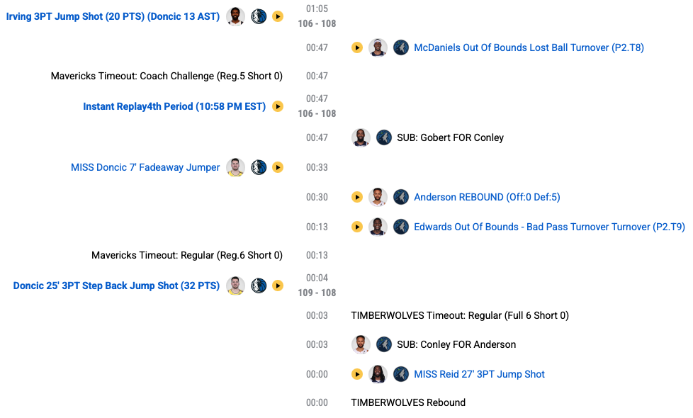

## Motivation{.smaller}

- How do NBA players help their teams win?
- How do we quantify contributions?

. . .

- Idea: good players do things that show up in the box score
  - Points, rebounds, assists, steals, blocks, turnovers
  - Easy to collect, sort, explain

. . .

- Fails to account for roles
  - 10 assists for a guard vs 10 rebounds by a center
- Problem: should some stats weigh more heavily than others?

. . . 

- Bigger problem: Not everything appears in the box score
  - Setting screens, rotating on defense, communicating
  - Good shot selection, diving for loose balls
  - The "little things"

## Plus/Minus

:::{.callout-note icon=false}
## Definition: Plus/Minus

A player's **plus/minus** is the point differential that a player's team accrues while they are on the court.
:::

- Intuition: if your team outscores opponent while you're on the court, you must be doing something right

- To compute, must know who is on the court at all times

## Play-by-Play NBA Data{.smaller}

{fig-align="center" width="60%"}

- Entry created when player does something tracked by scorekeeper
- Can use the **hoopR** package to scrape play-by-play data into R

## Stint-Level Data{.smaller}

- Stint: period of play b/w substitutions where the same 10 players remain on the court.

- Can form a data table from play-by-play log where
  - Rows correspond to stints
  - Columns for game context: start & end scores, length in minutes, etc.
  - Column for every player's *signed on-court indicator*
  
- Signed on-court indicators:
  - +1 if on-court and playing at home
  - -1 if on-court and playing on the road
  - 0 if not on court

# Plus/Minus

## Computing Individual +/- (Concept)

- Consider Shai Gilgeous-Alexander (2024-25 MVP)
- To compute SGA's +/-:

  1. Sum the home team point differentials for all stints where SGA was on the court and playing at home.
  2. Sum the *negative* of the home team point differentials for all shifts where SGA was on the court and playing on the road.
  3. Add the two totals from Steps 1 and 2.

## Computing Individual +/- (Formula)
- $\Delta_{i}$: home team point differential in shift $i$
- $x_{i, \textrm{SGA}}$: SGA's signed on-court indicator:
  - $x_{i, \textrm{SGA}} = 0$ if SGA off-court in stint $i$
  - $x_{i, \textrm{SGA}} = 1(-1)$  if SGA on-court at home (away) in stint $i$
- SGA's +/- is just
$$
\sum_{i = 1}^{n}{x_{i,\textrm{SGA}} \times \Delta_{i}}.
$$

# Digression: Matrix Computation

## Notation{.smaller}

- $n$: total number of stints in the season
- $p$: total number of players
- For each stint $i = 1, \ldots, n$ and player $j = 1, \ldots, p$: 
  - $x_{ij} = 1$ if player $j$ on-court at home in stint $i$
  - $x_{ij} = -1$ if player $j$ on-court on road in stint $i$
  - $x_{ij} = 0$
- $\Delta_{i}$: home-team differential in stint $i$
. . .

- Player $j$'s +/-: $\sum_{i}{x_{ij}\Delta_{i}}$

## Stint Design Matrix{.smaller}
- Arrange $x_{ij}$'s into an $n \times p$ matrix

$$
\boldsymbol{\mathbf{X}} = 
\begin{pmatrix}
x_{1,1} & \cdots & x_{1,p} \\
\vdots & & \vdots \\
x_{n,1} & \cdots & x_{n,p}
\end{pmatrix}
$$

. . .

- Collect all $n$ $\Delta_{i}$'s into a vector of length $n$
$$
\boldsymbol{\Delta} = \begin{pmatrix} \Delta_{1} \\ \vdots \\ \Delta_{n} \end{pmatrix}
$$

## Computing all +/-'s
- Can compute **all** player's w/ matrix-vector multiplication $\boldsymbol{\mathbf{X}}^{\top}\boldsymbol{\Delta}$
$$
\begin{pmatrix}
x_{1,1} & \cdots & x_{n,1} \\
\vdots & & \vdots \\
x_{1,p} & \cdots & x_{n,p}
\end{pmatrix}
\begin{pmatrix} \Delta_{1} \\ \vdots \\ \Delta_{n} \end{pmatrix}
= 
\begin{pmatrix}
x_{1,1}\Delta_{1} + x_{2,1}\Delta_{2} + \cdots + x_{n,1}\Delta_{n}\\
\vdots \\
x_{1,p}\Delta_{1} + x_{2,p}\Delta_{2} + \cdots + x_{n,p}\Delta_{n}
\end{pmatrix}
$$

## Issues with Plus/Minus{.smaller}

- Is Lou Dort really better than Jayson Tatum???

- Differences in +/- could be a result of
  - Differences in skill
  - Differences in playing time
  - Differences in teammate & opponent quality

# Adjusted Plus/Minus

## From Totals to Rates{.smaller}
- Comparing totals favors players with more playing time
- APM works with rates: point differential per 100 possessions

## An Initial APM Model
- Associate each player $j$ with a latent strength $\alpha_{j}$
- $\alpha_{j}$'s are **unknown**: they must be estimated from data
- $Y_{i}$: point differential per 100 possessions in stint $i$ 
- $h_{1}(i), \ldots, h_{5}(i)$ & $a_{1}(i), \ldots, a_{5}(i)$: identities of players on court in stint $i$

$$
\begin{align}
Y_{i} &= \alpha_{0} + \alpha_{h_{1}(i)} + \alpha_{h_{2}(i)} + \alpha_{h_{3}(i)} + \alpha_{h_{4}(i)} + \alpha_{h_{5}(i)} \\
~&~~~~~~~~~~- \alpha_{a_{1}(i)} - \alpha_{a_{2}(i)} - \alpha_{a_{3}(i)} - \alpha_{a_{4}(i)} - \alpha_{a_{5}(i)} + \epsilon_{i},
\end{align}
$$

## Example{.smaller}

* Dec 23, 2024 game Dallas Mavericks (away) at Golden State Warriors (home):
  * DAL: Luka Doncic, Dereck Lively II, Kyrie Irving, P.J. Washington, and Klay Thompson
  * GSW: Stephen Curry, Buddy Hield, Andrew Wiggins, Jonathan Kuminga, and Kevon Looney.

* Per 100 possessions, with these lineups DAL expects to outscore GSW by
$$
-1 \times (\alpha_{0} + \alpha_{SC} + \alpha_{BH} + \alpha_{AW} + \alpha_{JK} + \alpha_{KL}) +(\alpha_{LD} + \alpha_{KI} + \alpha_{DL} + \alpha_{PW} + \alpha_{KT}).
$$

. . .

- Now imagine that you replaced Doncic w/ Anthony Davis.
- Per 100 possessions, DAL expects to outscore GSW by
$$
-1 \times (\alpha_{0} + \alpha_{SC} + \alpha_{BH} + \alpha_{AW} + \alpha_{JK} + \alpha_{KL}) +(\alpha_{AD} + \alpha_{KI} + \alpha_{DL} + \alpha_{PW} + \alpha_{KT}).
$$

. . .

- DAL expects to score $\alpha_{\textrm{AD}} - \alpha_{\textrm{LD}}$ more points per 100 possessions with Davis than Doncic, **all else being equal**

## Potential Issue: Interpretation
- Individual $\alpha_{j}$'s are meaningless!
- $\alpha_{j}$: change in point differential per 100 possessions b/w
  - Playing 5-on-5 w/ player $j$ on the court
  - Playing 5-on-4 w/ player $j$ off the court
  
- Luckily, we can interpret differences (or *contrasts*) like $\alpha_{j}-\alpha_{j'}$ 

## APM As A Linear Model

* Append a column of 1's to $\boldsymbol{\mathbf{X}}$ to form $n \times (p+1)$ matrix $\boldsymbol{\mathbf{Z}}$
* Let $\boldsymbol{\mathbf{z}}_{i}$ be the $i$-th row of $\boldsymbol{\mathbf{Z}}$
* APM asserts: $Y_{i} = \boldsymbol{\mathbf{z}}_{i}^{\top}\boldsymbol{\alpha} + \epsilon_{i}.$

. . .

* Tempting to estimate $\boldsymbol{\alpha}$ with least squares
$$
\textrm{argmin} \sum_{i = 1}^{n}{\left( Y_{i} - \boldsymbol{\mathbf{z}}_{i}^{\top}\boldsymbol{\alpha} \right)^{2}} .
$$

## Non-identifiability

- Recall that the model asserts
$$
\begin{align}
Y_{i} &= \alpha_{0} + \alpha_{h_{1}(i)} + \alpha_{h_{2}(i)} + \alpha_{h_{3}(i)} + \alpha_{h_{4}(i)} + \alpha_{h_{5}(i)} \\
~&~~~~~~~~~~- \alpha_{a_{1}(i)} - \alpha_{a_{2}(i)} - \alpha_{a_{3}(i)} - \alpha_{a_{4}(i)} - \alpha_{a_{5}(i)} + \epsilon_{i},
\end{align}
$$
- Imagine we add 5 to every $\alpha_{j}$: right-hand side remains unchanged
- While we can't hope to learn $\alpha_{j}$'s exactly, can still interpret *constrasts* $\alpha_{j} - \alpha_{j'}$

## Singularity{.smaller}
* Least squares problem does not have a unique solution!
* Columns of $\boldsymbol{\mathbf{Z}}$ are linearly dependent
  * The first element in each row is equal to 1 (for intercept)
  * 5 entries equal to 1 (for home players)
  * 5 entries equal to -1 (for away players)
* If you know all but one column, you can perfectly determine that column
* $\boldsymbol{\mathbf{Z}}^{\top}\boldsymbol{\mathbf{Z}}$ not invertible

## Baseline Contrasts{.smaller}

- Classify certain players as "baseline"-level (e.g., $< 250$ minutes)
- Re-number players so first $p'$ are non-baseline
- **Assumption**: $\alpha_{j} = \mu$ for all baseline players $j > p'$
  - All baseline players **assumed** to have the same underlying skill

. . .

- For non-baseline $j = 1, \ldots, p,$ let $\beta_{j} = \alpha_{j} - \mu$
- $\beta_{j}$: effect of replacing player $j$ *with a baseline player*

## A Re-parametrized Model{.smaller}
- $\tilde{\boldsymbol{\mathbf{Z}}}$ be the $n \times (p'+1)$ submatrix of $\boldsymbol{\mathbf{Z}}$ s.t.
  - First column is all 1's
  - Remaining columns: signed on-court indicators for non-baseline players
- Turns out: 
  - $\tilde{\boldsymbol{\mathbf{Z}}}\boldsymbol{\beta} = \boldsymbol{\mathbf{Z}}\boldsymbol{\alpha}$
  - There quantity $\sum_{i = 1}^{n}{\left(Y_{i} - \tilde{\boldsymbol{\mathbf{z}}}_{i}^{\top}\boldsymbol{\beta}\right)^{2}}$ has a unique minimizer

$$
\hat{\boldsymbol{\beta}} = \left( \tilde{\boldsymbol{\mathbf{Z}}}^{\top}\tilde{\boldsymbol{\mathbf{Z}}}\right)^{-1}\tilde{\boldsymbol{\mathbf{Z}}}^{\top}\boldsymbol{\mathbf{Y}}.
$$

# Weighted Adjusted Plus/Minus

## Missing Context{.smaller}

- APM does not account for context
- Can over-inflate garbage-time performance when outcome essentially determined

> "can artificially can artificially inflate the importance of performance in low-leverage situations, when the outcome of the game is essentially decided, while simultaneously deflating the importance of high-leverage performance, when the final outcome is still in question. For instance, point differential-based metrics model the home team’s lead dropping from 5 points to 0 points in the last minute of the first half in exactly the same way that they model the home team’s lead dropping from 30 points to 25 points in the last minute of the second half". 

## A Weighted Version of APM
- Introduce weight $w_{i}$ for stint $i$
- Find $\tilde{\boldsymbol{\beta}}$ minimizing $\sum{w_{i}\left(Y_{i} - \tilde{\boldsymbol{\mathbf{z}}}_{i}^{\top}\boldsymbol{\beta}\right)^{2}}$
- Solution: letting $\boldsymbol{\mathbf{W}}$ denote diagonal matrix w/ entries $w_{i}$
$$
\hat{\boldsymbol{\beta}}_{w} = \left( \tilde{\boldsymbol{\mathbf{Z}}}^{\top}\tilde{\boldsymbol{\mathbf{Z}}}\right)^{-1}\tilde{\boldsymbol{\mathbf{Z}}}^{\top}\boldsymbol{\mathbf{W}}\boldsymbol{\mathbf{Y}}
$$

## Estimating wAPM {.smaller}
- Example weights: 
  * $w_{i} = 1$ if lead $< 10$
  * $w_{i} = 0$ if one team leads by $> 30$ at start of $i$
  * $w_{i} = 1 - (\textrm{StartDiff} - 10)/20$: if $10 \leq \textrm{lead} \leq 30$

## Looking Ahead

- (w)APM is quite sensitive to certain choices:
  - Definition of baseline players
  - Choice of weights
- Constant baseline skill assumption is highly unsatisfactory
- Issues due to inability to use least squares
- Next time: alternative estimation strategy
  - Avoids having to specify baseline players
  - Estimates a latent strength for *all* players

## Project 1{.smaller}

- Thanks for sorting yourselves into groups!
  - If you still don't have a group, let me know!
  - On Canvas, you need to be in a group under "Projects 1&2 Groups"
- [Project information](../../projects/project1.qmd) posted:
  - Requirements for written report and presentation
  - Non-exhaustive list of project topics
  - Main requirement: must use play-by-play or event-level data
  - I.e., use data more granular than game- or season-level totals
- Project Check-in: by **Friday 25 September** email me a short overview of your project
  - Precise problem statement & overview of data and analysis plan
  - Happy to help brainstorm & narrow down analysis in Office Hours (or by appt.)
