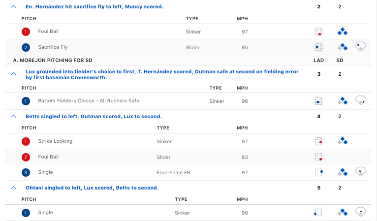

## Motivation{.smaller}

- March 20, 2024 Dodgers vs Padres game
- Shohei Ohtani hit two singles
  - 3rd inning, 2 outs and no runners on base, Ohtani singled into right field.
  - 8th inning, with 1 out and runners on first and second base, Ohtani singled into left center field, driving in one run
- Which single was more valuable?

. . .

- Second single scored a run
- But first single put runner in scoring position

. . . 

- This lecture: a "currency" for evaluating plays that accounts for
  - Actual runs scored
  - Potential to score more runs
  
- Lectures 7 & 8: apportioning offensive & defensive credit + WAR

## History of Tracking Data in Baseball{.smaller}

- 2006: Sportvision debuts camera system for tracking pitch trajectory
- 2008: Sportvision releases PITCHf/x data to MLB to power GameDay app
- 2008-2012(?): people realize GameDay API is publicly accessible & start scraping
- 2017: PITCHf/x phased out in favor of radar-based Trackman
  - Trackman originally developed for golf
- Statcast: ball & player tracking
- Made available through BaseballSavant (also scrapable)

## Statcast Data in R{.smaller}

- Scott Powers' **sabRmetrics** package
- Bill Petti's **baseballR** package

- Provides tools for scraping
  - Statcast data via [baseballsavant.mlb.com](baseballsavant.mlb.com)
  - FanGraphs, BaseballReferencs
  
. . .  

- See [lecture notes](../../lectures/lecture06.qmd) for function code that
  - Scrapes whole season's Statcast data
  - Takes 30-45 minutes per season: run once & save

# Exploring StatCast Data


## Contextual Variables{.smaller}
- Each row corresponds to a pitch
- Numeric id for games (`game_id`), at-bats w/in games (`atbat_num`), & pitches w/in at-bats (`pitch_num`)
- `inning` and `inning_top_bot`
- `balls`, `strikes`, `outs_when_up`
- `batter_id`, `pre_runner_1b_id`, `pre_runner_2b_id`, `pre_runner_3b_id`: offensive player ID
- `pitcher`, `fielder_2`, ..., `fielder_9`: defensive player IDs


## Player IDs

- Statcast uses MLB Advanced Media ID number for players
- Will be useful to look up player names using IDs (and vice versa)
- [Chadwick Register](https://github.com/chadwickbureau/register) maintains a database
- See [lecture notes](../../lectures/lecture06.qmd) for code to download

# Expected Runs

## Definition
- For each pitch let $R$ be numbers of runs scored in remainder of half-inning
- $\textrm{o} \in \{0,1,2\}$ be number of outs
- $\textbf{br} \in \{"000", "100", "010", "001", "110", "101", "011", "111"\}$
- $\rho(\textrm{o}, \textrm{br}) = \mathbb{E}[R \vert \textrm{o}, \textrm{br}]$
- Avg. number of runs team expects to score based on current game-state


## Runs Scored in Half-Inning{.smaller}
- Suppose there are $n_{a}$ pitces in at-bat $a$ 
- $R_{i,a}$: number of runs scored in half-inning after pitch $i$ in at-bat $a$
- Step 1: append a column to `statcast2024` containing $R_{i,a}$ values
- Will utilize the following Statcast variables
  - `bat_score`: batting team score **before** the pitch is thrown
  - `post_bat_score`: batting team score **after** pitch is thrown


## Illustration: Dodger's 8th Inning{.smaller}




## Computing All $R_{i,a}$'s
- Split data table based on half-inning
  - `group_by(game_id, inning_number, inning_topbot)`
- Get the **last** value of `post_bat_score` w/in half-inning
- $R_{i,a}$: `dplyr::last(post_bat_score) - bat_score`


## Computing Expected Runs{.smaller}
- Recall definition: $\rho(\textrm{o}, \textrm{br}) = \mathbb{E}[R \vert \textrm{o}, \textrm{br}]$
- Group pitches by `Outs` and `BaseRunner` and average `RunsRemaining`
- Useful to create 25th state for end of inning

## Run Value{.smaller}
- $\textrm{RunsScored}$: number of runs scored in each at-bat
$$
\textrm{RunValue} = \textrm{RunsScored} + \rho(\textrm{o}_{\text{end}}, \textrm{br}_{\text{end}}) - \rho(\textrm{o}_{\text{start}}, \textrm{br}_{\text{start}}) 
$$
- Run value tracks actual number of runs scored and change in expectancy

. . .

- To compute $\textrm{RunValue}$ we must
  1. Compute $\textrm{RunsScored}$
  2. Determine starting and ending game-states (i.e., `Outs` and `BaseRunner`)


## Computing $\textrm{RunsScored}$
- Computing $\textrm{RunsScored}$ involves
  1. Sort pitches by at-bat number & pitch-number
  2. Subtract **first** `bat_score` from **last** `post_bat_score` in each at-bat


## Starting & Ending States{.smaller}


- Starting state of pitch $i+1$ is ending state of pitch $i$
- Use `dplyr::lead()` to get *next* value (`next_Outs`, `next_BaseRuner`)

. . .

- **Last** value of `next_Outs` and `next_BaseRunner` gives at-bat's ending state
- Compute this w/in every at-bat in every game

. . .

- Must go from pitch- to at-bat-level
- First pitch in at-bat gives starting state


# Assessing Batter Performance

## Computing RE24
- For each player, sum `RunValue` across all at-bats (RE24)

```{r}
#| label: compute-re24
#| eval: false
#| echo: true
re24 <-
  statcast2024 |> 
  dplyr::filter(pitch_number == 1) |>
  dplyr::select(game_pk, at_bat_number, batter) |>
  dplyr::inner_join(y = runValue2024, by = c("game_id", "at_bat_number")) |>
  dplyr::group_by(batter) |>
  dplyr::summarise(RE24 = sum(RunValue),N = dplyr::n()) |>
  dplyr::inner_join(y = tmp_lookup, by = "batter") |>
  dplyr::select(Name, RE24, N)
```


## Looking Ahead
- Suppose batter hits a single and baserunner advances from 1st to 3rd
  - Run Value reflects change in run expectancy. `BaseRunner`: `'100'` $\rightarrow$ `'101'`)
  - Is it fair to give batter all the credit for creating run value?
- Lecture 7: Dividing run value b/w baserunner and batter
- Lecture 8: Divide negative run value b/w pitcher and fielder

## Projects{.smaller}

- Project Check-in: by **Friday 25 September** email me a short overview of your project
  - Precise problem statement & overview of data and analysis plan
  - Happy to help brainstorm & narrow down analysis in Office Hours (or by appt.)
  - Inspiration: exercises in lecture notes & [project information](../../projects/project1.qmd) page

