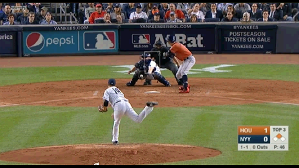
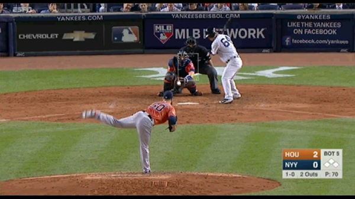
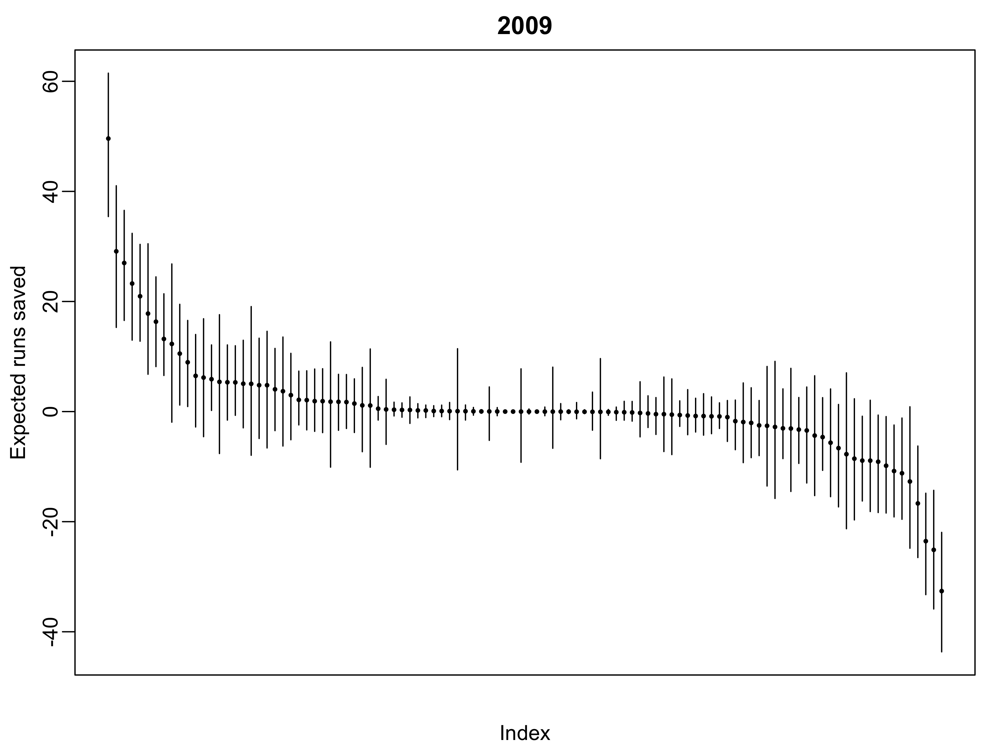
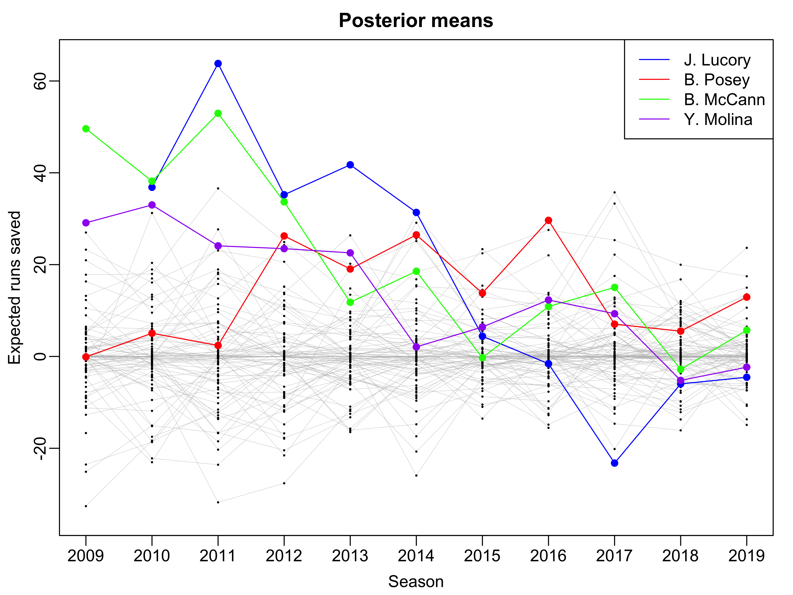

## Motivation{.smaller}

::: {#fig-mccann-castro layout-ncol=2}

{#fig-mccann}


{#fig-castro}

:::

* Both pitches miss the strike zone and should, by rule, be called balls
* But pitch on the right was called a strike

. . . 

* How much do catchers influence umpires' calls?

## Framing{.smaller}

- Ability of catcher to receive pitch so as to increase $\mathbb{P}(\textrm{called strike})$
- Ability to "steal a strike" / "turn balls into strikes"
- Studied by the sabermetrics community since 2008
- Lots of popular press attention b/w 2014 & 2016

## Jonathan Lucroy Needs a Raise{.smaller}

> According to Baseball Prospectus, Lucroy produced 121 stolen strikes last season and in the past five seasons clocks in at more than 1,000, the most in MLB. And if you believe the metrics, these stolen strikes have been worth about 18 wins during his five-year career -- just shy of what Giancarlo Stanton's entire output has added up to during the same time. Still, Lucroy's discreetly prodigious output has been underestimated. By fans. By the media. By his own team. And certainly by the game's salary structure. Even in today's post-Moneyball world, pitch framing is viewed through a skeptical lens; a value-added talent, sure, but one for which teams are reluctant to pay. While Stanton cashed in with a 13-year, $325 million contract this offseason and Mike Trout begins the first year of his $144.5 million deal, Lucroy was actually more valuable last year. For that he earned $2 million; this year, he'll make $3 million.

> Put another way: The most impactful player in baseball today is the game's 17th highest-paid catcher.

## Overview{.smaller}

- Goal: estimate how many runs catcher saves his team
- Multilevel model to predict $\mathbb{P}(\textrm{called strike})$
  - Random intercepts for batter, pitcher, catcher
  - Fixed effect: baseline called strike prob. based on previous season
- "Runs Saved Above Replacement"

# Value of a Called Strike

## Elaborated Run Expectancy{.smaller}

- Lectures 6--8: run expectancy at the at-bat level
- Today: run expectancy at the *pitch* level
- $\rho(\textrm{o}, \textrm{counts})$:
  - Avg. runs scored following pitch in given count & game state
  - 3 **o**uts $\times$ 12 counts
- Roadmap:
  - Compute how many runs scored after each pitch (`RunsRemaining`)
  - Identify taken pitches using `description`
  - Average `RunsRemaining` w/in bins defined by call, outs, and counts

## High-Level Model{.smaller}

- Level 1: Fixed effects of location ($x$ and $z$) may be non-linear
$$
\log \left( \frac{\mathbb{P}(Y_{i} = 1)}{\mathbb{P}(Y_{i} = 0)} \right) = B_{b[i]} + C_{c[i]} + P_{p[i]} + f(x_{i}, z_{i})
$$

- Level 2: Random intercepts for **B**atter, **P**ither, **C**atcher
$$
\begin{align}
B_{i} &= \mu_{B} + u^{(B)}_{b[i]}; u^{(B)}_{b} \sim \mathcal{N}(0,\sigma^{2(B)}) \\
C_{i} &= \mu_{C} + u^{(C)}_{c[i]}; u^{(C)}_{c} \sim \mathcal{N}(0,\sigma^{2(C)}) \\
P_{i} &= \mu_{P} + u^{(P)}_{p[i]}; u^{(P)}_{p} \sim \mathcal{N}(0,\sigma^{2(P)})
\end{align}
$$

. . . 

- Idea #1: Assume $f(x,z) = \beta_{X}x + \beta_{Z}z$
  - Problem: *assumes* $\mathbb{P}(\textrm{called strike})$ is monotonic

## Adjusting for Historical Tendencies

- Instead of trying to pre-specify functional form of $f(x,z)$
$$
\log \left( \frac{\mathbb{P}(Y_{i} = 1)}{\mathbb{P}(Y_{i} = 0)} \right) = B_{b[i]} + C_{c[i]} + P_{p[i]} + \beta_{p} \log\left(\frac{\hat{p}(x_{i}, z_{i})}{1 - \hat{p}(x_{i}, z_{i})}\right)
$$

- $\hat{p}(x,z)$: **baseline** called strike prob. estimated from 2024 season

## Historical GAM{.smaller}

- Filter out 2024 pitches too far away from strike zone
  - `plate_x` outside [-1.5, 1.5]
  - `plate_z` outside [1,6]

```{r}
#| label: fit-hgam
#| eval: false
#| echo: true
#| message: false
library(mgcv)
hgam_fit <- 
  bam(formula = Y ~ stand + p_throws + s(plate_x, plate_z),  
      family = binomial(link="logit"), 
      data = taken2023)
```


## Fitting a Multi-level Model

- Fixed effects: baseline/historical log-odds of a called strike
- Random effects: catcher, batter, pitcher
- Binary response: must use `glmer` rather than `lmer`
- Like regular logistic regression, must specify the `family` argument

## Extracting $u^{(C)}_{c}${.smaller}

- Model: $C_{c} = \mu_{C} + u^{(C)}_{c}$ where $u^{(C)}_{c} \sim \mathcal{N}(0,\sigma^{2}_{c})$
- Reminder: cannot directly estimate catcher-specific intercepts $C_{c}$ or global average $\mu_{C}$
- We can extract deviations $u^{(C)}_{c}$ using `ranef()`


# Runs Saved Above Replacement

## Defining Replacement Level{.smaller}

- Non-replacement: top $30 \times 2$ catchers sorted by number of pitches caught
- $\overline{u}^{(C)}_{R}$: average $u^{(C)}_{c}$ among all replacement-level catchers
- Counter-factual prediction: for every pitch, get model prediction for
  - Called strike prob. with original catcher
  - Called strike prob. with replacement-level catcher

## Counterfactual Predictions {.smaller}

- Original log-odds: 

$$
\mu_{C} + u_{c[i]}^{(C)} + B_{b[i]} + P_{p[i]} + \hat{\beta}_{p} \times \log\left(\frac{\hat{p}(x_{i}, z_{i})}{1 - \hat{p}(x_{i}, z_{i})} \right)
$$

. . . 

- Counter-factual log-odds:

$$
\mu_{C} + \overline{u}_{R}^{(C)} + B_{b[i]} + P_{p[i]} + \hat{\beta}_{p} \times \log\left(\frac{\hat{p}(x_{i}, z_{i})}{1 - \hat{p}(x_{i}, z_{i})} \right)
$$


## Computing RSAR{.smaller}

- Weight change in called strike prob. by value of called strike
- RSAR: Sum over all pitches received by catcher over the season

## Uncertainty Quantification

- Top framers appear to save nearly 30 runs over replacement
- Translates to about 3 wins
- Exercise: use the bootstrap to quantify uncertainty
  - Create several bootstrap re-samples of 2025 taken pitches
  - Must re-fit the multilevel model and compute RSAR
  - Use the original replacement-level 
- Quantifying uncertainty: **critical** to determining monetary value of framing

## My Own Research{.smaller}

- I've studied framing since 2015
  - Initial paper: Bayesian models to "borrow strength" across umpires
  - Conclusion: lots of uncertainty in framing effects
  
- More recently: use Bayesian Additive Regression Trees (BART) to model $\mathbb{P}(\textrm{strike})$
  - Faster & more flexible: (2 hours on a desktop vs 50 hours on a cluster)
  - Better predictions: mis-classification of 7% vs 10%
  - Similar conclusions: possibly large effect but lots of uncertainty
  
## Framing Effectsin 2009

{width=80%}

## Framing Over Time

{width=80%}

## Announcements{.smaller}

- Projects are due tomorrow at noon

- Next week: new unit on ranking & simulation
  - Lectures 12 & 13: hockey power rankings & the NCAA D1 National Championship
  - Lecture 14: Markov chain simulations
  - Lecture 16 & 17: Mock drafts & other simulations
  
- Project 2 Information will be posted by Sunday evening